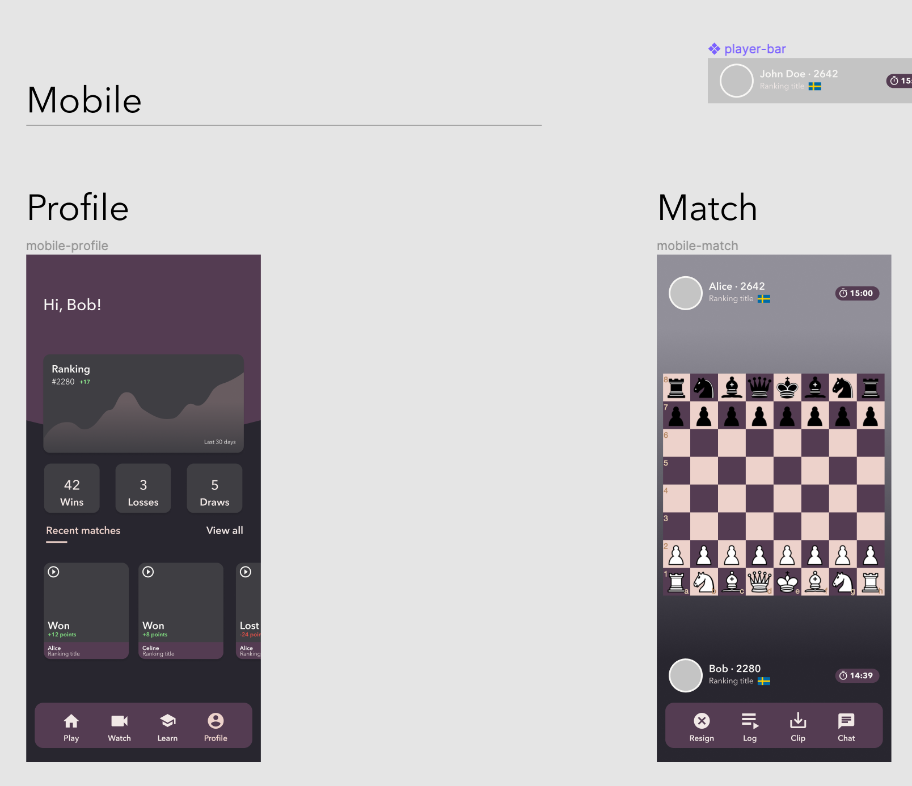

# AppName: Chess?

Setting up and playing chess matches online

**Technologies:** React, Recoil, Typescript, Firebase, Vitejs, Chessboardjsx, Chess.js, Stockfish  
**API(s):** https://chessblunders.org/  
**Data:** FEN strings from ChessBlunders will be hydrated into a live playable chess game. Any changes made to the board, will generate a new FEN string, and store it in firebase. 
**Prototype:**  

## Minimal Viable Product Featureset

* Login with google.
* Create a match.
* List all matches.
* Join a match.
* Play a chess game agains another player.
* Play a solo practice game vs AI, where a specific board state is loaded, where it is possible to "mate" in 2 or 3 turns, and play to see how many turns it takes you to "mate".
* Win / Loose / Draw.

## Extended Featureset (Streach goals)

* Game timer (stop to end turn).
* Watch along chat / aka spectators
* Clip functionality, like twich. Generate a gif from a set of FEN strings using a firebase cloud function, store the FEN string in firebase, and return a URL for the gif.
* Feature new clips on the front page.
* Replay matches (replay sequence of FEN strings).

## Resources

Forsyth-Edwards Notation (FEN): https://www.chess.com/terms/fen-chess  
Chess board component: https://www.chessboardjsx.com/  
Chess logic: https://github.com/jhlywa/chess.js  
Chess AI: https://github.com/nmrugg/stockfish.js  

Figma project: https://www.figma.com/file/3iUKHHol5BU6zsU5zE5wP7/prototype  
