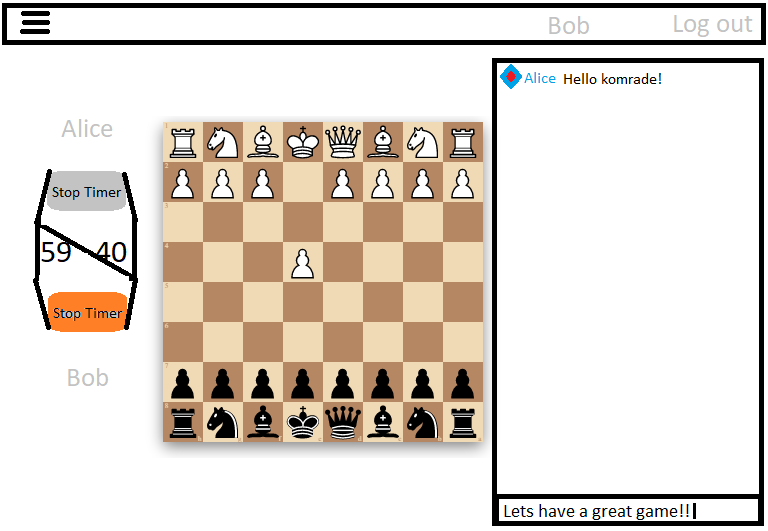

# iprog-project

**App name:** TBD  
**Short description:** Setting up and playing chess matches online  
**Framework(s):** React, Recoil  
**API(s):** https://chessblunders.org/  
**Data:** FEN strings from ChessBlunders will be hydrated into a live playable chess game. Any changes made to the board, will generate a new FEN string, and store it in firebase. 
**Prototype:** 
